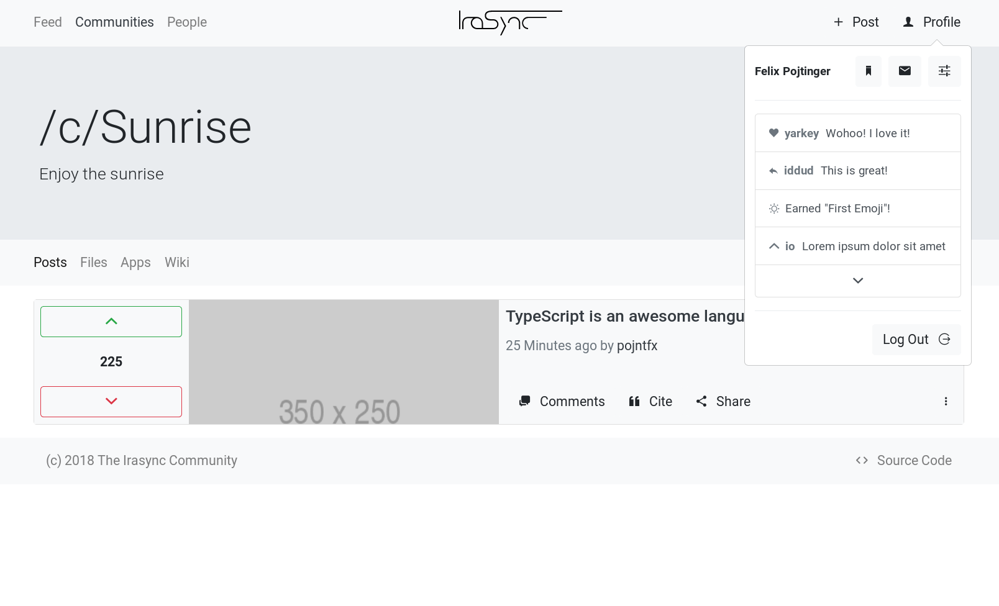
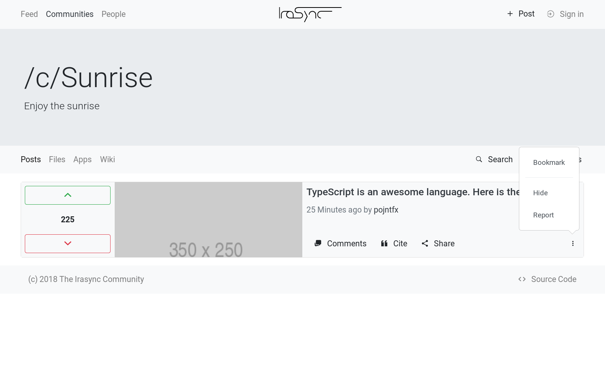
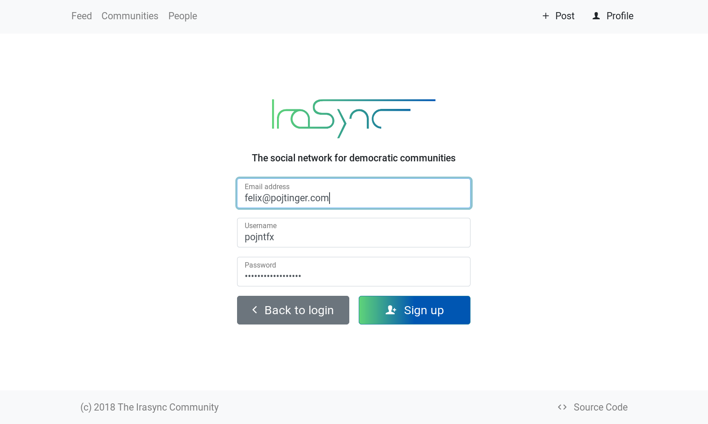
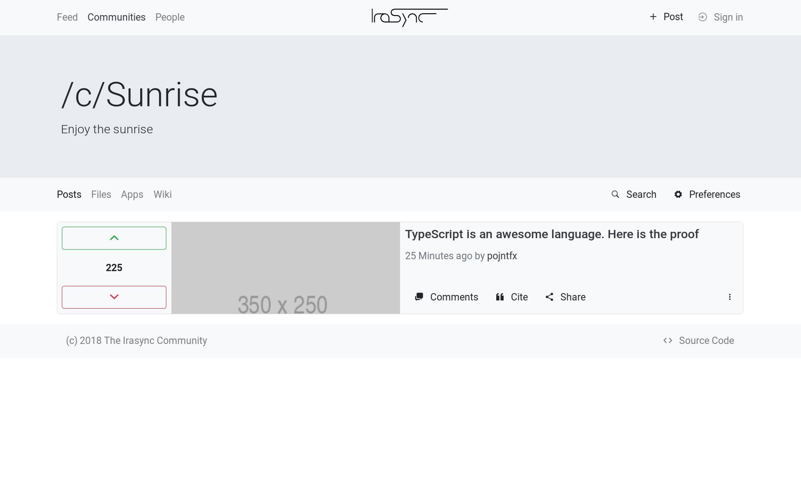
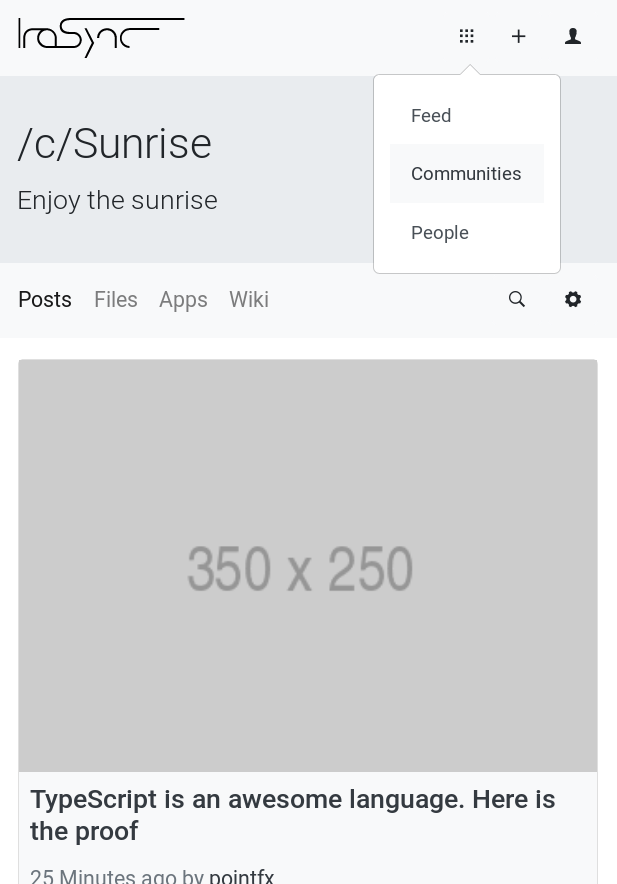
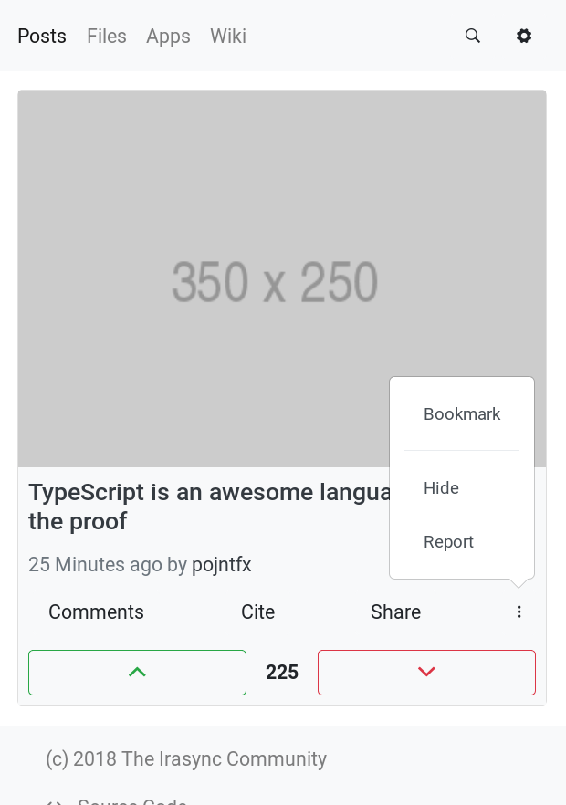
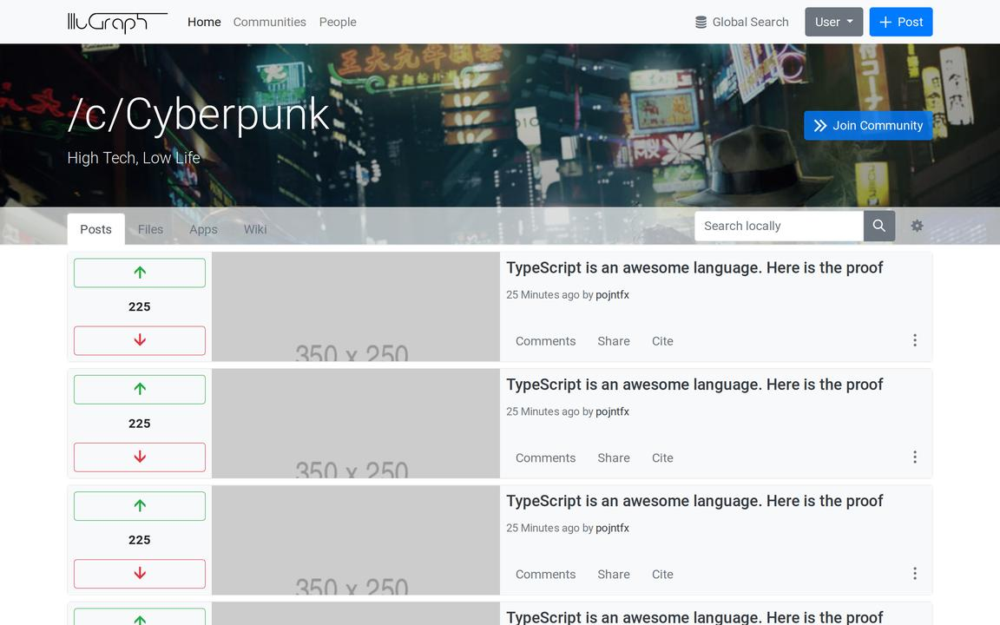
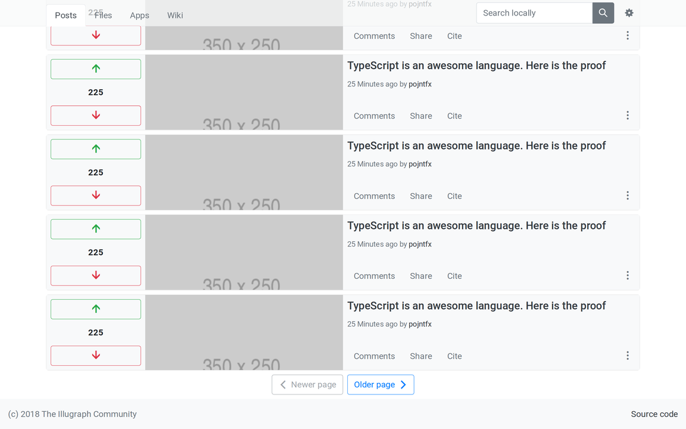
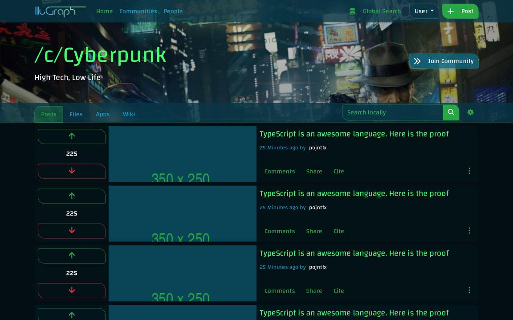
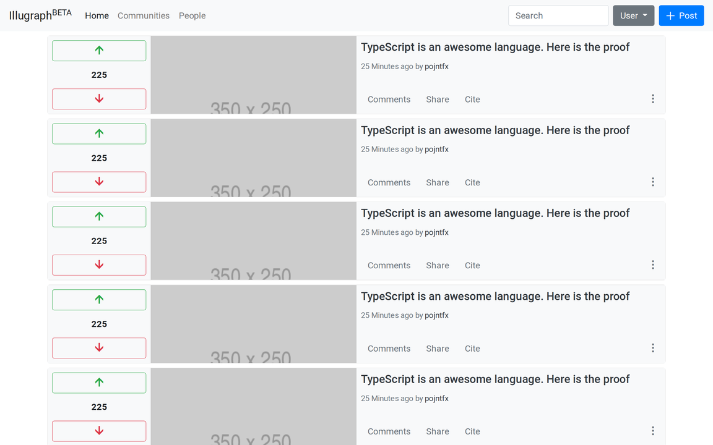

# Irasync React Frontend

An Irasync frontend implemented using React, Semantic UI and Apollo Client.

## Usage

```bash
# Install dependencies
yarn install
# Serve app on http://localhost:3000
yarn start

# Serve mockups on http://localhost:3002
yarn mockups

# Update and serve docs (annotated source on http://localhost:3003, full docs on http://localhost:3004)
yarn docs
# Only update the docs
yarn docs:update
# Only serve the docs on (annotated source on http://localhost:3003, full docs on http://localhost:3004)
yarn docs:serve

# To do the same with only the annotated source, run
yarn docs:minimal<command> # with <command> as either :update to update, :serve to serve and nothing to do both
# To do the same with only the full docs, run
yarn docs:full<command> # with <command> as either :update to update, :serve to serve and nothing to do both
```

## Screenshots

> Below are the screenshots of the "static_mockups" branch as well as screenshots from before the move to React. These may be outdated.

### Angular evaluation with ng-bootstrap













### Mockups created with Bootstrap

### A community in light mode

#### Initial view on desktop



#### Scrolled down view on desktop



#### Initial view on mobile


### A community in dark mode

#### Initial view on desktop (dark mode)



#### Scrolled down view on mobile


### The home page (Older, more minimal version)



## License

Irasync React Frontend Reference Implementation
Copyright (C) 2018 Felix Pojtinger

This program is free software: you can redistribute it and/or modify
it under the terms of the GNU General Public License as published by
the Free Software Foundation, either version 3 of the License, or
(at your option) any later version.

This program is distributed in the hope that it will be useful,
but WITHOUT ANY WARRANTY; without even the implied warranty of
MERCHANTABILITY or FITNESS FOR A PARTICULAR PURPOSE. See the
GNU General Public License for more details.

You should have received a copy of the GNU General Public License
along with this program. If not, see <http://www.gnu.org/licenses/>.
