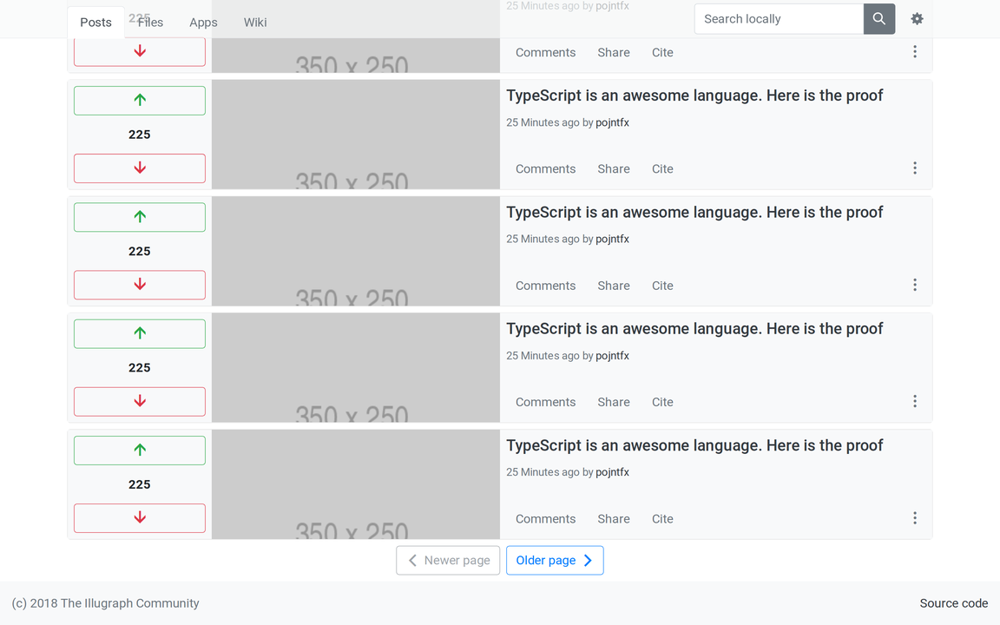
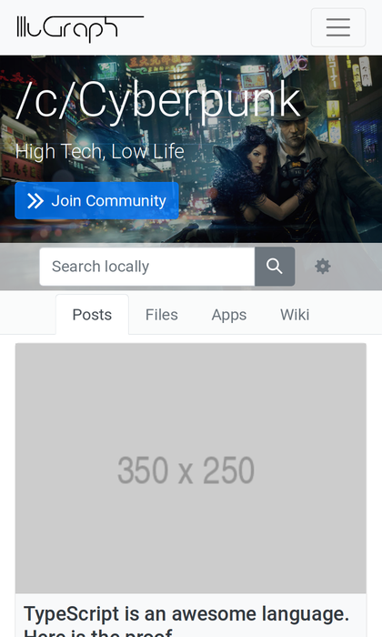
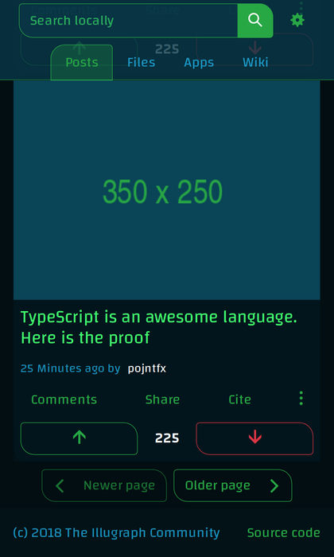
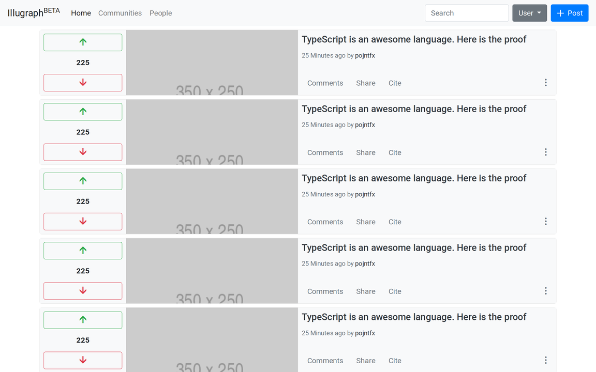

# irasync-frontend-web

> An Irasync frontend implemented as a SPA based on Angular, Apollo Client and ng-bootstrap.
> Irasync is still evaluating and testing different stacks! Check out the different branches of this repo to try out the experiments.
> Node >= 9, npm and yarn should be installed using your OS's package manager before continuing.

## Build Setup

```bash
# install dependencies
yarn install

# serve with hot reloading at localhost:4200
yarn start

# lint the code (refer to the angular docs if you want to use this in your IDE)
yarn lint

# compile typescript
yarn build

# serve the docs at localhost:8080
yarn docs:serve

# update the docs after changes
yarn docs:update

# serve the static mockups (point your browser to http:localhost:8080/c/cyberpunk.html or http:localhost:8080/c/cyberpunk-dark.html to look at the styling)
yarn mockups:serve
```

## Screenshots

> Below are the screenshots of the "static_mockups" (currently master) branch. These may be outdated.

### A community in light mode

#### Initial view on desktop


#### Scrolled down view on desktop



#### Initial view on mobile



### A community in dark mode

#### Initial view on desktop (dark mode)


#### Scrolled down view on mobile



### The home page (Older, more minimal version)



## License

Irasync Frontend Reference Implementation
Copyright (C) 2018 Felix Pojtinger

This program is free software: you can redistribute it and/or modify
it under the terms of the GNU General Public License as published by
the Free Software Foundation, either version 3 of the License, or
(at your option) any later version.

This program is distributed in the hope that it will be useful,
but WITHOUT ANY WARRANTY; without even the implied warranty of
MERCHANTABILITY or FITNESS FOR A PARTICULAR PURPOSE.  See the
GNU General Public License for more details.

You should have received a copy of the GNU General Public License
along with this program.  If not, see <http://www.gnu.org/licenses/>.