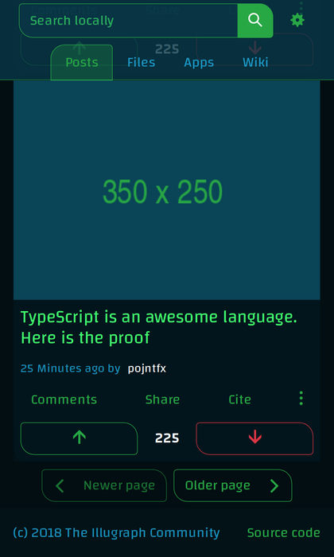

# Irasync React Frontend

An Irasync frontend implemented using React, Semantic UI and Apollo Client.

## Usage

```bash
# Install dependencies
yarn install
# Serve app on http://localhost:3000
yarn start
# Serve mockups on http://localhost:3002
yarn mockups
# Update docs (run this before serving them)
yarn docs:update
# Serve docs on http://localhost:3003
yarn docs
```

## Screenshots

> Below are the screenshots of the "static_mockups" branch. These may be outdated.

### A community in light mode

#### Initial view on desktop


#### Scrolled down view on desktop


#### Initial view on mobile


### A community in dark mode

#### Initial view on desktop (dark mode)


#### Scrolled down view on mobile



### The home page (Older, more minimal version)


## License

Irasync React Frontend Reference Implementation
Copyright (C) 2018 Felicitas Pojtinger

This program is free software: you can redistribute it and/or modify
it under the terms of the GNU General Public License as published by
the Free Software Foundation, either version 3 of the License, or
(at your option) any later version.

This program is distributed in the hope that it will be useful,
but WITHOUT ANY WARRANTY; without even the implied warranty of
MERCHANTABILITY or FITNESS FOR A PARTICULAR PURPOSE. See the
GNU General Public License for more details.

You should have received a copy of the GNU General Public License
along with this program. If not, see <http://www.gnu.org/licenses/>.
